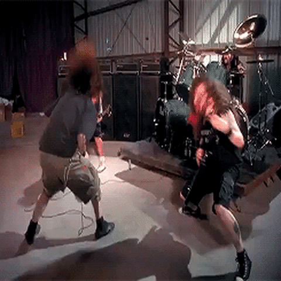
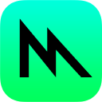
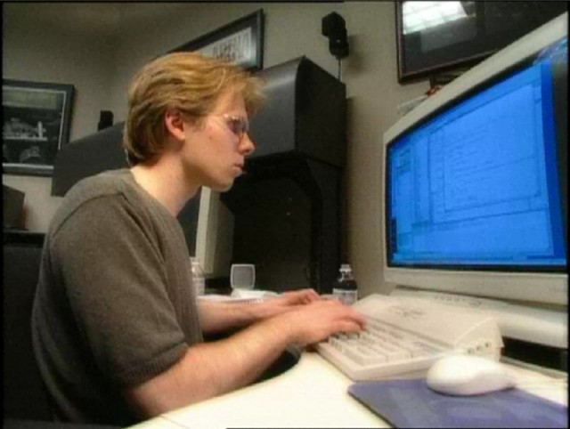
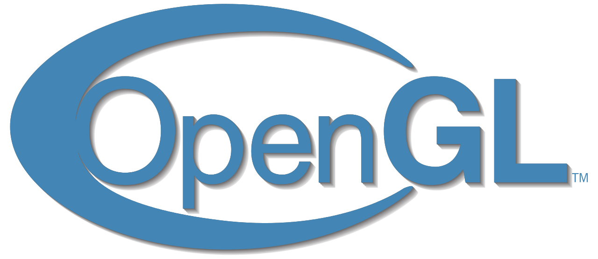
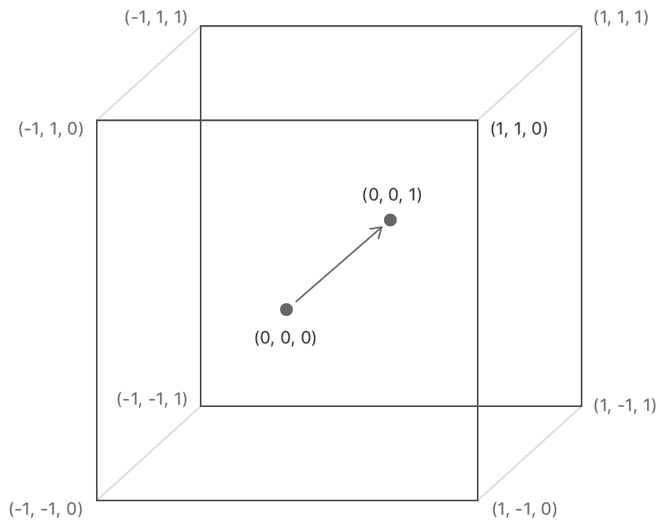

<h1><center>Quem sou eu? </center></h1>

<h3>Ricardo Rachaus</h3>
<h4>
Dev iOS da Concrete

Desenvolvedor de jogos
</h4>

<center>​</center>

<br></br>
<br></br>
<br></br>
<br></br>
<br></br>


<center><h1> The Roots Of Metal </h1></center>

<br></br>
<br></br>
<br></br>
<br></br>

<center>​</center>

<br></br>
<br></br>
<br></br>
<br></br>

<center>​</center>

<center><h2> API Gráfica da Apple</h2></center>

<br></br>
<br></br>
<br></br>
<br></br>


## Índice


- O que é?
- História de computação gráfica
- APIs gráficas
    - OpenGL
    - Metal
- Como funciona
    - GPU
    - Shaders
    - Pipeline
- Metal nos frameworks
- Demo
- Aplicações

<br></br>
<br></br>
<br></br>
<br></br>

### Antes de começar, um pequeno aviso:

Você nunca fará:
```swift
import Metal
```

<br></br>
<br></br>
<br></br>

## O que é?

- API gráfica lançada em 2014
- Interface para conversar com a GPU
- Melhor performance para devices Apple
- Apenas lida com renderização
- Feita em C/C++

<br></br>
<br></br>
<br></br>

<center>Aplicações</center>
-----------------
-----------------
<center>Metal</center>
-----------------
-----------------
<center>GPU</center>
-----------------

<br></br>
<br></br>

## História da Computação Gráfica

- Cada plataforma tinha sua própria API
- Cada programa era único para cada computador
- Nos anos 90 veio o OpenGL pela Silicon Graphics Inc.
- OpenGL veio para ser cross-platform
- Mas as empresas não queriam adotar (como Apple)

<br></br>
<br></br>
<br></br>
<br></br>

### Mas um cara mudou tudo...

<br></br>
<br></br>
<br></br>
<br></br>

# John Carmack

<center>​</center>

- Considerado um dos melhores programadores de todos os tempos
- Co-fundador da id Software
- Ao criar Quake, obrigou as empresas a usar o OpenGL

<br></br>
<br></br>
<br></br>
<br></br>

<center>​</center>

<br></br>
<br></br>
<br></br>
<br></br>

### Mas o tempo passou e o OpenGL foi ficando para trás...

<br></br>
<br></br>
<br></br>
<br></br>

## APIs gráficas

<center>
​
​

​
​
</center>

<br></br>
<br></br>
<br></br>

### OpenGL

- OpenGL é velho e está sendo substituído
- É mantido por compatibilidade
- Difícil de usar para projetos mais exigentes
- Cada empresa faz sua implementação

### Metal

- Metal é uma API recente
- Performático
- A Apple que desenvolve
- Mais poder de expressão

<br></br>
<br></br>
<br></br>
<br></br>

## Como funciona

O “funcionamento básico” do Metal consiste de alguns passos:
- Criar um buffer e adicionar os vértices
- Carregar os shaders
- Setar configurações de como o frame será renderizado
- Criar um comando e executá-lo

<br></br>
<br></br>
<br></br>

#### Coordenadas no Metal:

<center>​</center>

<br></br>
<br></br>

## GPU

- GPU é feita para paralelismo
- Várias ULAs (Unidades Lógicas Aritméticas)
- É extremamente eficiente para computar valores
- Mas não substitui a CPU
- Hoje é usada em campos além da computação gráfica

-----------------

- Enquanto um CPU tem poucos cores (4, 8 e etc.)
- A GPU mais simples tem 700 cores chegando até 4000

<br></br>
<br></br>
<br></br>

## Shaders

- São programas que são executados na GPU
- Tem uma linguagem própria, nosso caso, MSL (Metal Shading Language)
- A MSL tem sintaxe parecida com C++14
- Os shaders são escritos em arquivos “.metal”
- Há três tipos de shaders no Metal:
    - Vertex
    - Fragment
    - Kernel (Compute)

<br></br>
<br></br>
<br></br>

## Pipeline

<center>Vertex Shader</center>
-----------------
-----------------
<center>Tesselation e Rasterization</center>
-----------------
-----------------
<center>Fragment Shader</center>
-----------------

<br></br>
<br></br>
<br></br>

## Metal nos frameworks

- Está presente nos frameworks gráficos da Apple (UIKit, SpriteKit e SceneKit)
- Ele está “escondido" em mais de uma camada de abstração.
- Qualquer renderização em um dispositivo da Apple usa Metal.

<br></br>
<br></br>
<br></br>
<br></br>

<center><h1>UIKit* -> Core Graphics -> Quartz -> Metal</h1></center>

<h3>* ou qualquer outro framework gráfico da Apple</h3>

<br></br>
<br></br>
<br></br>
<br></br>


# Demo

<br></br>
<br></br>
<br></br>
<br></br>


# Se o Metal é uma API de baixo nível, então por que usar?

<br></br>
<br></br>
<br></br>
<br></br>

## Aplicações

- Machine Learning
- Visão Computacional
- Gráficos em geral
- Desenvolvimento de jogos
- Cálculos físicos e matemáticos complexos
- Problemas que exigem programação paralela
- Processamento de imagens
- Redes neurais
- E etc.

<br></br>
<br></br>
<br></br>
<br></br>

# Bônus

<center>​</center>

<br></br>
<br></br>

<center><h1>Obrigado</h1></center>

<center>​</center>

<br></br>
<br></br>